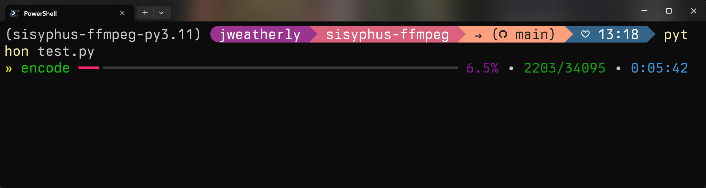

# Introduction

The `sisyphus-ffmpeg` Python module is a wrapper around `ffmpeg` that makes stream mapping and options for processing a bit easier to handle.  The module can be used as-is, but it was designed to support the `sisyphus-client` software used for distributed encoding and processing (which would explain the loading of JSON configurations).

## Sample Code

### Pure Pythonic

```python
from ffmpeg import Ffmpeg, SourceMap, OutputMap

# Create the Ffmpeg object
ff = Ffmpeg()

# Add the sources for `ffmpeg` to use
ff.sources = [
    "source_file_1.mkv",
    "source_file_2.ac3",
]

# Define all of the source maps which map a stream from a given
# source (zero-indexed) and a stream that will be ultimately proccessed
# and muxed into the output file.  When using specifiers, the stream
# number is the nth stream of that specifier type in the file.  If
# there's no specifier, it's the nth stream of the file without regard
# to type.
ff.source_maps = [
    SourceMap(source=0, specifier="Video", stream=0),
    SourceMap(source=1, specifier="Audio", stream=0),
    SourceMap(source=0, specifier="Subtitles", stream=0),
]

# Once the source maps are created, each source map is now a stream that
# can be processed via the output map.  The streams are zero-indexed and
# based on the order of the source maps of the previous section.

# The 0th video stream from the source map is the first entry: the video
# file. Another way of writing this would be to just remove the specifier
# which would pull the 0th stream overall from the source map section.
ff.output_maps.append(
    OutputMap(
        stream=0, 
        specifier="Video", 
        options={
            "codec": "libx265",
            "crf": 19,
            "pix_fmt": "yuv420p10le",
            "preset": "slow",
            "x265-params": {
                "limit-sao": 1,
                "bframes": 8,
                "psy-rd": 1,
                "psy-rdoq": 2,
                "aq-mode": 3
            }
        }    
    )
)

# The 0th audio stream from the source map is the second entry: the audio
# file.  Another way of writing this would be to remove the specifier and
# specify the 1st track which selects the 1st track overall from the source
# map.
ff.output_maps.append(
    OutputMap(
        stream=0, 
        specifier="Audio", 
        options={
            "codec": "libopus",
            "b": "128k",
            "ac": 2,
            "vbr": "on",
            "compression_level": 10,
            "frame_duration": 60,
            "application": "audio"
        }    
    )
)

# The 0th subtitle stream from the source map is the third entry: the MKV
# file.  Again, another way of writing this would be to remove the specifier
# and specify the 2nd track.  This selects the 2nd overall track from the
# source map.
ff.output_maps.append(
    OutputMap(
        stream=0,
        specifier="Subtitles",
        options={
            "codec": "copy"
        }
    )
)

# Define the output file where everything will end up
ff.output_file = "/shared/output_file.mkv"

# Run the encode and make it verbose so we can see the progress.
ff.run(verbose=True)
```

### From a JSON file

To use JSON to populate the encoder settings, it must validate successfully against the included [JSON schema file](schema/ffmpeg.schema.json).  It's not very complicated, and most of the options are used in the example below.

The Python part is fairly straightforward:
```python
from ffmpeg import Ffmpeg

# Create the Ffmpeg object
ff = Ffmpeg()

# Load the JSON file with all of the settings
ff.load_from_file("test.json")

# Run the encode and make it verbose so we can see the progress.
ff.run(verbose=True)
```

The JSON file holds all of the information and gets processed to fill in all of the sources, source maps, output maps, and output file information.  It's also validated against the JSON schema file to ensure that the information is valid before it gets parsed.

This JSON example file has the exact same information in it as the "pure Python" example has in code.

```json
{
  "sources": [
    "source_file_1.mkv",
    "source_file_2.ac3"
  ],
  "source_maps": [
    {
      "source": 0,
      "specifier": "v",
      "stream": 0
    },
    {
      "source": 1,
      "specifier": "a",
      "stream": 0
    },
    {
      "source": 0,
      "specifier": "s",
      "stream": 0
    }
  ],
  "output_maps": [
    {
      "specifier": "v",
      "stream": 0,
      "options": {
        "codec": "libx265",
        "crf": 19,
        "pix_fmt": "yuv420p10le",
        "preset": "slow",
        "x265-params": {
          "limit-sao": 1,
          "bframes": 8,
          "psy-rd": 1,
          "psy-rdoq": 2,
          "aq-mode": 3
        }
      }
    },
    {
      "specifier": "a",
      "stream": 0,
      "options": {
        "codec": "libopus",
        "b": "128k",
        "ac": 2,
        "vbr": "on",
        "compression_level": 10,
        "frame_duration": 60,
        "application": "audio"
      }
    },
    {
      "specifier": "s",
      "stream": 0,
      "options": {
        "codec": "copy"
      }
    }
  ],
  "output_file": "/shared/output_file.mkv"
}
```

## Extra Bits

### Progress Bars

The `sisyphus-ffmpeg` module can simplify the output of the encode to only show progress.  The `ffmpeg` module will search for the first video stream from the stream map and use that stream's frame count for the progress bar.  To use it, simply set `Ffmpeg.settings.progress_bar` to true and call the encode with no options.

```python
from ffmpeg import Ffmpeg

# Create the Ffmpeg instance and load the configuration.
ff = Ffmpeg()
ff.load_from_file("test.json")

# Enable the progress bar.
ff.settings.progress_bar = True

# Run the encode without any options and enjoy!
ff.run()
```

This should result in a fairly simple progress bar.



### Media Information
The `sisyphus-ffmpeg` module also contains an `ffprobe`-powered class that will list the streams contained in a given media file.  This can save a substantial amount of time if you need to figure out which input streams you want to feed to `ffmpeg`.

```python
from ffprobe import Ffprobe

# Load the source file into MediaInfo
info = Ffprobe(media_path="test.mkv")
```

To get all of the streams, you can use the `get_streams()` method.  If you want to get more granular, you can specify a stream type as an argument.  Regardless of the stream type, they will all be zero indexed as part of that type to mirror how stream specifiers work in `ffmpeg`.

```python
# To list all of the streams/tracks in the file:
[print(f'- {i}') for i in info.get_streams()]
```

Output:

```
- StreamInfo(codec='hevc', stream=0, language='eng', bitrate=5017364, forced=False, default=True, frames=34095, stream_type='video', codec_long='H.265 / HEVC (High Efficiency Video Coding)', title='Cool Video Title', channels=None)
- StreamInfo(codec='ac3', stream=1, language='jpn', bitrate=192000, forced=False, default=True, frames=44439, stream_type='audio', codec_long='ATSC A/52A (AC-3)', title='Stereo', channels=2)
- StreamInfo(codec='opus', stream=2, language='eng', bitrate=122130, forced=False, default=False, frames=23701, stream_type='audio', codec_long='Opus (Opus Interactive Audio Codec)', title='Surround 5.1', channels=2)
- StreamInfo(codec='ass', stream=3, language='eng', bitrate=2473, forced=False, default=True, frames=842, stream_type='subtitle', codec_long='ASS (Advanced SSA) subtitle', title='Full Subtitles', channels=None)
- StreamInfo(codec='ass', stream=4, language='eng', bitrate=2484, forced=False, default=False, frames=511, stream_type='subtitle', codec_long='ASS (Advanced SSA) subtitle', title='Signs and Songs', channels=None)
```

The example for just looking at the audio streams is as simple:

```python
# For just the audio streams
[print(f'- {i}') for i in info.get_streams("audio")]
```

Output:

```
- StreamInfo(codec='ac3', stream=0, language='jpn', bitrate=192000, forced=False, default=True, frames=44439, stream_type='audio', codec_long='ATSC A/52A (AC-3)', title='Stereo', channels=2)
- StreamInfo(codec='opus', stream=1, language='eng', bitrate=122130, forced=False, default=False, frames=23701, stream_type='audio', codec_long='Opus (Opus Interactive Audio Codec)', title='Surround 5.1', channels=2)
```
